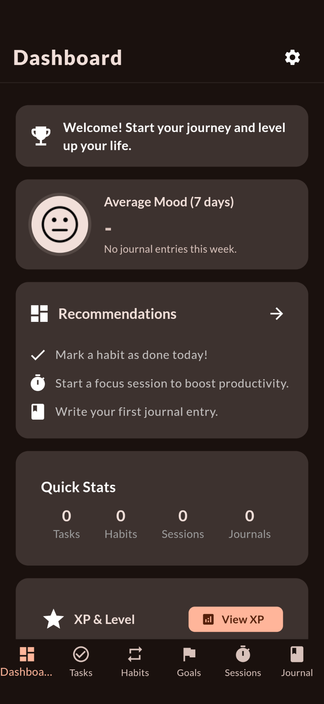
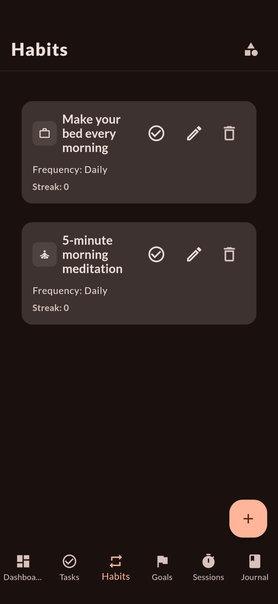
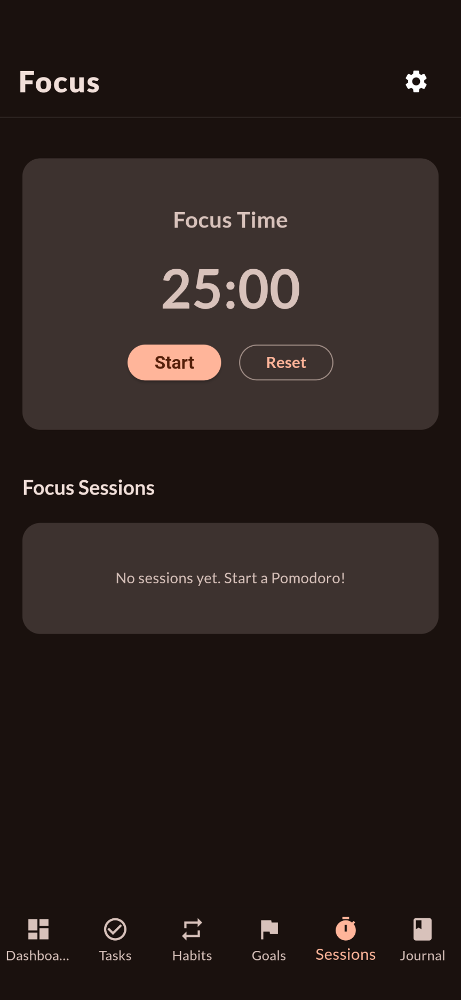
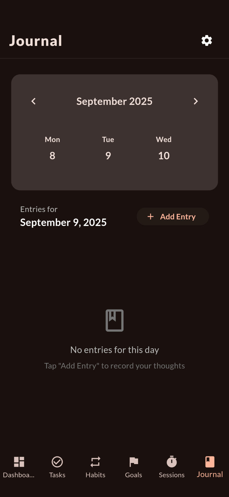

# LockIn

Your Personal Habit & Productivity Companion

[](https://github.com/gokadzev/LockIn/stargazers)
[](https://github.com/gokadzev/LockIn/fork)
[](https://github.com/gokadzev/LockIn/releases)
[](https://github.com/gokadzev/LockIn/releases)
[](LICENSE)

---

<a href="https://ko-fi.com/gokadzev" target="_blank" title="ko-fi">
  
</a>

---

## Features

- **Habit Tracking**: Create, organize, and complete habits with streaks and categories.
- **XP & Level System**: Earn XP for completing habits and tasks, unlock new levels, and stay motivated.
- **Advanced Statistics**: Visualize your progress with streaks, focus clusters, accuracy, fatigue, and more.
- **Productivity Dashboard**: See your daily, weekly, and monthly stats at a glance.
- **Custom Categories**: Group habits and tasks for better organization.
- **Engagement Notifications**: Smart reminders to keep you on track.
- **Cross-Device Support**: Works great on phones and tablets.

---

## Screenshots

|  |  |  |  |
| ------------------------------------------------------------------------------- | ------------------------------------------------------------------------------- | ------------------------------------------------------------------------------- | ------------------------------------------------------------------------------- |

---

## Download

[](https://github.com/gokadzev/LockIn/releases/latest)

---

## License

```
Copyright © 2026 Valeri Gokadze

LockIn is a free software licensed under GPL v3.0
It is distributed in the hope that it will be useful, but WITHOUT ANY WARRANTY;
without even the implied warranty of MERCHANTABILITY or FITNESS FOR A PARTICULAR PURPOSE.
```

```
Being Open Source doesn't mean you can just make a copy of the app and upload it on playstore or sell
a closed source copy of the same.
Read the following carefully:
1. Any copy of a software under GPL must be under same license. So you can't upload the app on a closed source
  app repository like PlayStore/AppStore without distributing the source code.
2. You can't sell any copied/modified version of the app under any "non-free" license.
   You must provide the copy with the original software or with instructions on how to obtain original software,
   should clearly state all changes, should clearly disclose full source code, should include same license
   and all copyrights should be retained.

In simple words, You can ONLY use the source code of this app for `Open Source` Project under `GPL v3.0` or later
with all your source code CLEARLY DISCLOSED on any code hosting platform like GitHub, with clear INSTRUCTIONS on
how to obtain the original software, should clearly STATE ALL CHANGES made and should RETAIN all copyrights.
Use of this software under any "non-free" license is NOT permitted.
```

See the [GNU General Public License](https://github.com/gokadzev/LockIn/blob/master/LICENSE) for more details.

---

## Contribute

Contributions are always welcome. Please read our [contributing guidelines](https://github.com/LockIn/LockIn/blob/master/CONTRIBUTING.md) before contributing.
